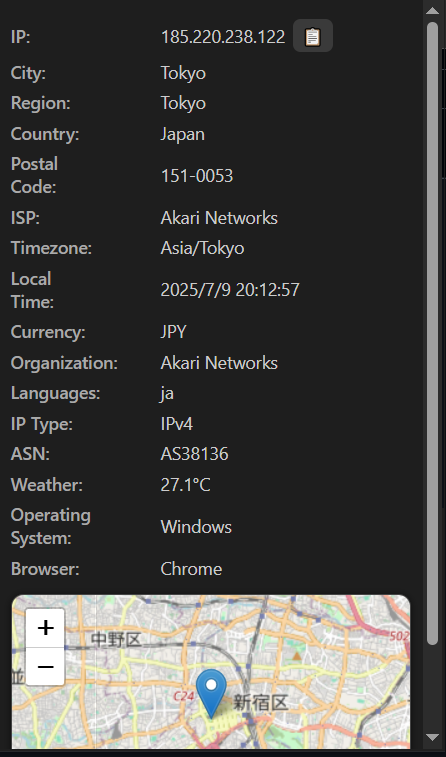

# IP Info Lookup Chrome Extension

A powerful and elegant Chrome extension that displays your public IP address along with detailed geographic, network, system, and weather information. Supports light/dark mode and includes an interactive map (Leaflet) loaded locally.

## 🌟 Features

- 🌐 Show public IP address with one click  
- 🗺️ Display detailed geo info: country, city, region, ZIP code  
- 🌍 View location on an interactive map (offline Leaflet support)  
- 🕒 Local time, timezone, and currency  
- 📡 ISP, organization, IP type, ASN  
- 🌤️ Current weather at your location  
- 🖥️ Show system info: OS and browser details  
- 🕶️ Auto dark/light theme detection  
- 📋 One-click IP copy button  
- 🔒 All map resources are loaded locally for privacy

## Installation

1. Clone or download this repository:
   ```bash
   git clone https://github.com/yang-shuohao/ip-geo.git
2. Open Chrome and go to chrome://extensions/

3. Enable "Developer mode" (top right)

4. Click "Load unpacked" and select the extension folder (resize-image)

5. The extension will be installed and its icon will appear near the address bar

## Usage
1. Click the extension icon to open the popup.

2. The popup will instantly display your IP and location info.

3. Use the 📋 button to copy your IP address.

4. View your location on the embedded map.

## 🖼️ Screenshot


## 💰 Support This Project

If you find this project helpful, consider sponsoring or treating me a coffee ☕:

### 🧧 Donate via Chinese Payment (国内用户可扫码打赏)

<p align="center">
  
  
</p>

### 🌍 International Support

- [💸 Donate via PayPal](https://paypal.me/yangshuohao?country.x=C2&locale.x=zh_XC)

> Thank you for your support!